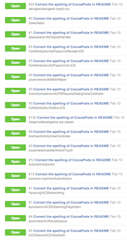

# débarasser

Cleanup your GitHub forks, when they're [gettin' outta control](https://github.com/ReadmeCritic).

[](https://twitter.com/ReadmeCritic/status/697553440810016769)

:fork_and_knife: :fr:

## Installation

```shell
$ git clone https://github.com/dkhamsing/debarasser.git
$ cd debarasser/
$ rake install
```

`debarasser` requires GitHub credentials in [.netrc](https://github.com/octokit/octokit.rb#using-a-netrc-file).

## Usage

```shell
$ debarasser

debarasser 0.1.0
getting forks ...
forks found: 732
1. ReadmeCritic/ADiOSUtilities
2. ReadmeCritic/chinese-copywriting-guidelines
# ...

proceed with delete? (y/n) y
1. deleting ReadmeCritic/ADiOSUtilities
2. deleting ReadmeCritic/chinese-copywriting-guidelines
3. deleting ReadmeCritic/EEJSelectMenu
4. deleting ReadmeCritic/HTTPParser
5. deleting ReadmeCritic/InspectableLabel
6. deleting ReadmeCritic/ios_sdk
# ...

done
```

## Contact

- [github.com/dkhamsing](https://github.com/dkhamsing)
- [twitter.com/dkhamsing](https://twitter.com/dkhamsing)

## License

This project is available under the MIT license. See the [LICENSE](LICENSE) file for more info.
